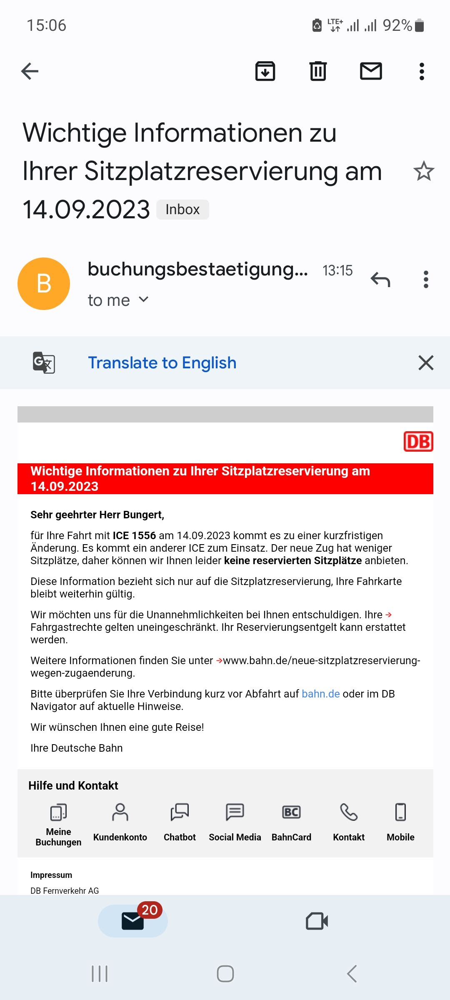

# 🚝 Wir bitten um Entschuldigung 🚨

*An on-going log of every issue I experience with Deutsche Bahn (DB).*

People who have never lived in Germany often cite it as a reliable, punctual country where everything runs on time. The truth is that DB trains are as late, cancelled, or delayed as trains in Italy, the UK, or Ireland - or anywhere else for that matter.

There is nothing magical about German trains, although I will admit that 2nd class on an ICE makes 1st class in the UK look like 3rd class, but don't rely on DB to get you where you want to go.

> [!CAUTION]  
> **Customer Announcement:** These are my opions and experiences - ich bitte um verständnis.

## Deutschland-Ticket

The Germany Ticket (Deutschland-Ticket or Deutschlandkarte) lets you travel on nearly all local transport (bus, tram, train).

But the operators have forced it to be a subscription ticket as they don't want tourists using it and want to cause as many headaches as possible for travelers.

You can't buy it from a machine, you have to waste hours at a local travel company service centre or the DB service centre getting the ticket.

If you are a tourist staying several weeks it would be cheaper to buy a Deutschland-Ticket subscription (which my partner did this summer for 1 month) then buy regular tickets.

Getting it from DB is the easiest as you don't need to wait for a physical card. It is all done in the app.

You should then cancel the subscription a few days after buying it. Just make sure this is done in-app before the end of the month or you will get charged for the next month too.

Also note, that several popular tourist destinations are not valid with the DT even if you travel on local trains - DB trying to milk tourist for all they can get.

DB know that there are more people too, but do they increase the size or frequency of the local trains? Nope... this way they can force people to buy more expensive long distance train tickets.

## Cancelled Trains

DB loves to cancel trains... and they delight in sending you emails informing you too. What they don't tell you is that the trains are replaced so if you are new in germany you might panic and think you need to buy a new ticket - one wonders if they do this on purpose.

Also why do they tell you that the train is cancelled? They are forcing their internal business logic on to customers. 

If I book a train to Münich I don't care if it train DB12345 or DB22345 - It still shows as ICE 2007 on the display.

They should just replace the trains without telling anyone as it makes no difference at all except if the number of seats has changed - but then just say this, don't say the train has been cancelled.

## Paper Tickets Trump Digital

On one of my trips where the train was replaced and no one had seats, two german passengers on the seat in front of me were arguing about seats and asked for help from the conductor.

Eventually they got the issue sorted out but I overheard the conductor say that paper tickets take priority over app tickets.

Then she explained that if someone has a seat reserved on the app, but someone else also has the same seat reserved and has printed their reservation out or bought their ticket from a machine/customer services they have priority and the person with the digital ticket will have to find another seat.

So much for digitalisation making things better! Remember always to print out your tickets - I guess DB doesn't care much about saving the planet.

Whoever booked their ticket first should have priority - and DB's system shouldn't allow such a cock-up in the first place.

## BahnCards

There are various discounts, if you are only travelling infrequently and don't need to change trains much the BahnCard 25 is good and doesn't cost much.

Just don't buy the Probe Bahncards. These are valid for 3 months and let you try out the discount - but you need to give 3 months notice to cancel, so basically it is really difficult to not sign up for these and then also get signed up for the yearly card - the subscription is automatically extend a year if you don't cancel within 3 months of the previous card ending - which is hard to do as it only lasts 3 months.

BahnCard 50 is pointless unless you travel with flex price tickets. It has then benefits of Bahncard 25  plus you get 50% off any flex price tickets. But as flex price tickets cost at least 50% more than standard tickets, you are not saving anything!

The only reason to buy 50, is if you travel a lot and these journeys involve more than one train. In this case due to the incredibly high number of cancellations and delays DB suffers from it would be prudent to buy flex price.

---

## Issue Tracker

Description                | 2023
-------------------------- | -----
Cancellation               | 3
Car on the line            | 1
Delays                     | 4
People/Animals on the line | 1
Smoking in the toilets     | 1
Technical Problem          | 2
Unexploded Bomb            | 1
Vandalism                  | 1
**Total Issues**           | **14**
**Trips Logged**           | **9**

I only started making notes in 2023 so all my journeys before I can't document. I would estimate that less than 5% of my travels have actually been on time and without incident in the last 3 years.

## 2023

> [!CAUTION]  
> **Customer Announcement:** Trips before september fallen aus - ich bitte um entschuldigung.

I didn't travel very much this year, but due to the Deutschland-Ticket I have been travelling a lot on local trains rather than long distance ones.

### 26th of December - Run Forest, Run!

*Stendal to Uchtspringer*

The train from Uchtspringer to Stendal was delayed, and left us 3 minutes to run from platform 5 to platfrom 7 (which is at the end of platform 1).

There were some people who were disabled who couldn't make this and had to wait at least two hours for the next train - they only run every two hours on weekends and holidays.

### 24th of December - Conductor Scroodge

*Stendal to Leipzig*

The train was nearly on time, but again a threat was made to stop at Magdeburg if people kept smoking in the toilets.

This issue occured earlier in the year too, on this exact train. The conductor, who was full of Christmas cheer, said if it happens again he will call the Police, and the Fire Brigade at Magdeburg and it will be a 2 hour delay and no one would get home.

This was Christmas Eve, the conductor would make Charles Dickens proud. Bah, Humbug!

Just like on the previous occassion there was no evidence of any smoking, just shoddy old trains which probably have defective smoke detectors. Or the conductor just likes demonstrating his power and enjoys scaring the old people travelling on the train.

Eventually made it Leipzig about 5 minutes lat due to stopping to let other trains past.

### 18th of December - Idiot decides to drive across the railway tracks

*Leipzig to Uchtspringer*

  

Another day, another disappointing DB journey that began at 5am, so that I could get the 7am train that I needed.

Whilst travelling between Leipzig and Uchtspringer via Stendal and Magdeburg, I managed to make it as far as Dessau before the train ground to a halt at Platform 1.

At first no information was given but after a while the DB App and the announcements at Dessau conceded that the issue was a car on the line between Dessau and Güterglück and that no trains would be going anywhere.

This is after keeping everyone on the train waiting for 20 minutes. I had to go back to Leipzig, which took a while as the trains to Leipzig were also delayed. I waited for the next train to leipzig, I had missed one as the train I arrived on when back to Leipzig 5 minutes after they told everyone to get off.

I was waiting on a second Regional Express (RE) that had arrived from Leipzig - either it would go back to Leipzig as well or it would go on to Magdeburg - both were fine for me.

After 20 minutes of waiting again still no announcement. An S-Bahn was leaving on Platform 3, should I swap trains? I decide it will be back in Leipzig before this one and make my way there. 3 minutes after getting to the S-Bahn, there was an announcement that we should all get out if we want to travel to Leipzig and travel on the RE on platform 1 - the train I had previously waited over 20 minutes on.

After everyone ran to platfrom 1 to board the RE, we discovered that all the people on the RE wanted to go Magdeburg and had no idea that the train was going back to Leipzig - there had been no announcement on their train at this point.

No one on the RE knew if they should get off, no one from the S-Bahn knew if they should get on as the displays still showed Magdeburg as the destination.

Communication seems to be non-existent between DB personnel and trains. Eventually the announcement was made and all the people that were hoping for Magdeburg finally alighted and we could proceed back to Leipzig.

Having missed a hospital appointment in Uchtspringer I eventually made it back to Leipzig about 10:40 in time for brunch at a cafe.

*Platform numbers may have been incorrect*

### 27th of October - Another Delay

*München to Leipzig*

  

A delay, not too bad but if you need to change trains in Leipzig you probably won't make it.

DB doesn't count anything under 5 minutes as a delay, and any trains that you need to connect with don't care either.

Luckily for me, I didn't need to travel any further than Leipzig. Also my ticket was bought by my employer for a Team Event and I could travel with any train.

### 24th of October - Fast train has to go slow

*Leipzig to München*

   

Off to München for a Team Event with whole Lower Funnel from MediaMarktSaturn.

First the rain was late, then it was cancelled due to technical issues. A new train came to replace the broken one.

Of course, as always, the replacement train had different carriage numbers and less seats, so no one had any reserved seats anymore.

We waited 25 minutes in the train before the announcement came that the replacement train had issues and couldn't leave the station.

20 minutes later we managed to leave, but at reduced speed. Apparently the train could only travel at 80% of its normal speed. 

I had a business ticket didn't need to swap trains so I didn't worry too much about this.

Later, during the trip another announcement: If the speed gets any lower we will have to switch to the slow track and go via other stations as the train needs to have a minimum speed to travel on the fast train to München.

Luckily, or so I thought, we were able to stay on the fast track. But then stopped in the middle of the route for an hour due to technical issues. :(

What was supposed to be a fast journey of about three and a quarter hours ended up taking five and a half hours.

Anyone needing to change trains in München would have definitely missed their connection.

### 16th of October - Who Let the Dogs Out?

*Dessau to Leipzig*

Again, things on the line that shouldn't be there - this time it's animals - with delays also caused by huge numbers of passengers.

This wouldn't be an issue if DB would lengthen and increase the number of local trains - It's not like they could claim not to know what effect the Deutschland-Ticket would have on passenger numbers.

### 4th of October - Zero minutes to change trains

*Uchtspringer to Leipzg*

  

Another typical delay leaving me with no way to catch my connecting train.

The later train was hit by vanadlism. Luckily, the driver managed to make up for lost time and I was only a few minutes late.

### 20th of September - Repairs and People on the Line

*Frankfurt Airport to Leipzig*

Thanks to idiots on the line and poor maintenance of rolling stock, my trip to Leipzig was delayed by nearly 15 minutes - I'm glad I didn't need to change trains or I wouldn't have made it.

### 14th of September

*Leipzig to Frankfurt Airport*

  

Train repairs (as usual), and a replacement train meaning no seats could be reserved.

### 19th of August - Danger UXB!

*Warnemünde - Leipzig*

I was on holiday in Warnemünder with my Partner, and on the way back - about 200m from Rostock Main Station - our train stopped.

After a while we got told that a Bomb had been unearthed near Rostock Station and that we would have to go back to Warnemünde.

Whilst travelling back we got told by conductors (in english and german) that about the bomb and that there would be busses waiting for us. I told my partner not to get her hopes up.

We arrived back at Warnemünde to find that there was no trains any more, there was also no bus like we had been promised - what a shocker!

An old german woman was complaining to DB employees and asking where the bus was - they said they had no idea and carried on smoking and talking about what they were going to do after work.

Everyone on the train was left to get to Rostock by themselves - DB gave no information except to say that the bomb disposal squad was coming from Schwerin and it would take several hours.

We had booked first class on ICE's from Warnemünde to Berlin and then from Berlin to Leipzig.

Now we had to travel by boat to Rostock as this was the only possibility. After 30 minutes of waiting and 2 hours of sailing we made it to find that there were trains still leaving Rostock. The only one we could find was an IC 2nd class.

It was delayed and during the trip to Berlin we heard on the news that the bomb wasn't a bomb... What was going to be about 3.5 hours in 1st class turned out to be about 7 hours on a boat, an IC and then an ICE to Leipzig.

A typical day travelling with trains through germany thanks to DB and a piece of piping dug up by builders.
